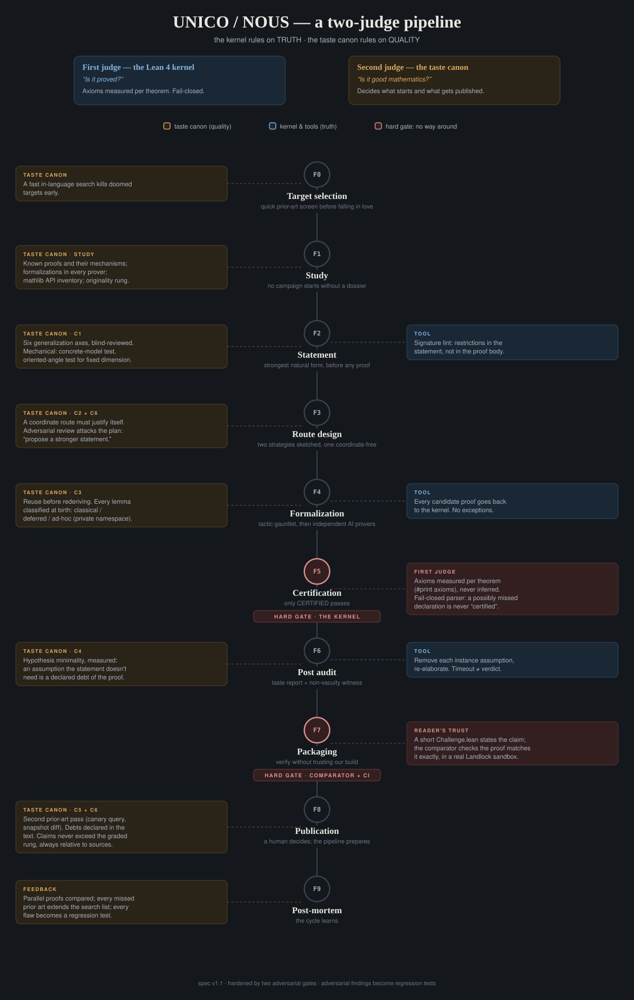

# The golden moment at r = 5: a Lean-certified core

<details open>
<summary><strong>English</strong></summary>

A human-directed, LLM-assisted structural study of Agrawal's conjecture
at r = 5. The flagship theorem identifies the quadratic moment unit
from the congruence with the golden unit:

```
ind₅(U₂) = 3 · ind₅((1 + √5) / 2).
```

The identity and its index consequence are checked by Lean. This repository
is the public verification surface: the formal core, the paper, and the
computational certificates. We do **not** prove the conjecture; the two open
problems (golden inertia/H4 and global emptiness of the fibers) are stated
precisely in the paper.

The conservative result-by-result prior-art assessment is in
[`NOVELTY_AND_PRIOR_ART.md`](NOVELTY_AND_PRIOR_ART.md). A separate
[`QUALITY_AUDIT.md`](QUALITY_AUDIT.md) records exact-environment architecture
measurements and their deliberately limited interpretation. The verification
tier of every claim is summarized in [`CLAIM_STATUS.md`](CLAIM_STATUS.md).

<details>
<summary><strong>UNICO/NOUS two-judge pipeline</strong></summary>

<p align="center">
  
</p>

This project follows the public
[`UNICO/NOUS two-judge pipeline`](https://github.com/Solarys431/unico-lean-proofs/blob/main/PIPELINE.md).
The diagram separates two decisions that this repository never conflates:
Lean checks whether a formal statement follows from its hypotheses; prior-art
review and mathematical judgment decide whether the statement is interesting,
well scoped, and responsibly publishable.

The application is auditable rather than merely asserted.  The first judge is
implemented by the pinned kernel build, per-declaration `#print axioms`,
fail-closed release checks, four Comparator surfaces and CI replay.  The second
judge is evidenced by the dated prior-art map, the fidelity log in
`formalization.yaml`, model-based adversarial review, claim corrections
recorded in Git, and regressions added after failures.  Two taste-canon checks
are not claimed as complete in this release: a mechanical assumption-removal
audit of every public theorem and a full upstream-candidate inventory for
auxiliary lemmas.

</details>

## Lean core

The implementation core consists of forty-two modules (6,056 source lines)
over pinned, unmodified Mathlib. It contains no `sorry`, `admit`,
`native_decide`, project-defined axiom, or opaque escape hatch. The separate
trusted `Challenge.lean` files necessarily contain proof holes; they are
statements, not part of the submitted implementation. Build:

```
lake exe cache get
lake build
```

The tracked [`AxiomAudit.lean`](AxiomAudit.lean) runs `#print axioms`
on the headline declarations. Its output contains only `propext`,
`Classical.choice`, and `Quot.sound`, the standard logical axioms used
by Mathlib; no project-defined axiom is present. GitHub Actions runs
this audit after every kernel build.

| Result | Declaration | File |
|---|---|---|
| **Moment covariance: t·Mⱼ = t⁻ʲ·Mⱼ** | `moment_covariance` | `MomentObstruction.lean` |
| **Moment obstruction: Mⱼ ≠ 0 ⟹ tʲ⁺¹ = 1** | `pow_succ_eq_one_of_moment_ne_zero` | `MomentObstruction.lean` |
| **Golden factorization: U₂ = (√5)⁵ε³** | `golden_moment_factorization` | `GoldenMoment.lean` |
| **Golden theorem: ind₅(U₂) = 3·ind₅(ε)** | `zmod_golden_moment_index` | `GoldenMoment.lean` |
| Index lemma | `mul_dvd_gcd_mul` | `IndexLemma.lean` |
| Golden Frobenius: ε^p = 1 − ε (inert case) | `golden_frobenius` | `InertiaCore.lean` |
| Golden half-period: ε^(p+1) = −1 | `golden_pow_p_succ` | `InertiaCore.lean` |
| Inertia theorem for J_n (golden form) | `inertia_J` | `InertiaCore.lean` |
| Fibonacci bridge: ε^(n+1) = F_(n+1)ε + F_n | `golden_pow_fib` | `InertiaCore.lean` |
| Golden–cyclotomic entanglement: ζ³ε²(ζ−1)⁴ = 5 | `entanglement` | `Entanglement.lean` |
| Inertia, divisibility forms (F_n / L_n) | `inertia_J_fib`, `inertia_J_lucas` | `FibBridge.lean` |
| Quadratic reciprocity bridge for 5 | `not_isSquare_five` | `Reciprocity.lean` |
| Canonical support witness: p ≡ 2 (mod 5) ⟹ p ∣ H_((p+1)/2) | `support_witness` | `SupportBridge.lean` |
| Fermat shadow (arithmetic glue) | `fermat_shadow` | `FermatShadow.lean` |
| **The bridge: for squarefree n with 5 ∤ n, Agrawal's congruence at r = 5 ⟹ n ∣ 5^(n−1) − 1** | `agrawal_fermat_shadow` | `AgrawalBridge.lean` |
| **The two-adic jaw: v₂(q−1) ≤ v₂(n−1) for every inert prime factor q of a counterexample** | `agrawal_two_adic_jaw` | `TwoAdicJaw.lean` |
| Mod-4 corollary: n ≡ 3 (mod 4) ⟹ every inert factor is ≡ 3 (mod 4) | `agrawal_inert_mod_four` | `TwoAdicJaw.lean` |
| 2-adic saturation of a divisor | `pow_two_dvd_of_not_dvd_half` | `TwoAdicJaw.lean` |
| Product identity (ζ−1)(ζ²−1)(ζ³−1)(ζ⁴−1) = 5 | `prod_pow_sub_one` | `AgrawalBridge.lean` |
| Mod-5 corollaries | `inertia_J_fib_mod5`, `inertia_J_lucas_mod5` | `Corollaries.lean` |
| Kernel form of the order bound: (ζ−1)^(10p²) = (ζ−1)^10, both inert classes | `order_bounded` | `OrderBound.lean` |
| Exact decomposition of an order through a norm power | `orderOf_norm_decomposition` | `NormOrder.lean` |
| Exact order of the norm-kernel component | `orderOf_norm_kernel` | `NormOrder.lean` |
| Exact \(q^2\)-threshold from the odd defect product | `odd_defectProduct_threshold`, `odd_defectProduct_normal_iff` | `NormOrder.lean` |
| Exact number of final-row candidates from the defect product | `defectMultiplier_le_div_iff`, `pureCandidate_below_sq_iff`, `twistedCandidate_positive_iff` | `NormOrder.lean` |
| Box identity and its arithmetic corollary | `prod_pairs_sub_prod_squares`, `lt_two_mul_of_sq_le` | `BoxLemma.lean` |
| Carmichael and Lucas–Carmichael numbers (Korselt) | `IsCarmichael`, `IsLucasCarmichael` | `Korselt.lean` |
| Korselt's criterion: Carmichael ⟹ Fermat pseudoprime in every coprime base | `IsCarmichael.fermatPsp` | `Korselt.lean` |
| Class arithmetic: k ≡ 1 (mod 4) factors ≡ 3 (mod 80) ⟹ product ≡ 3 (mod 80) | `prod_class_mod_eighty` | `ClassMod80.lean` |
| The escape stays closed: n ≡ 3 (mod 80) ⟹ n² ≢ 1 (mod 5) | `sq_not_one_mod_five` | `ClassMod80.lean` |
| lcm(p−1, p+1, 80) = 10(p²−1) for p ≡ 3 (mod 80) | `lcm_three_eq` | `LcmIdentity.lean` |
| Korselt's conditions give n ≡ p (mod 10(p²−1)) | `sub_dvd_of_korselt` | `LcmIdentity.lean` |
| Cyclotomic component of Agrawal's congruence | `lenstra_local` | `LenstraLocal.lean` |
| Recomposition: (X−1) ∣ f and Φ₅ ∣ f ⟹ (X⁵−1) ∣ f | `dvd_of_dvd_both` | `Recompose.lean` |
| The congruence modulo p | `agrawal_mod_p` | `LocalGlue.lean` |
| Local to global for squarefree n | `congruence_of_local` | `GlobalGlue.lean` |
| Bridge: k ≡ 1 (mod 4) factors ≡ 3 (mod 80) ⟹ n ≡ 3 (mod 80) | `mod_eighty_of_card` | `CardBridge.lean` |
| **The Lenstra–Pomerance proposition, original hypotheses** | `lenstra_proposition_card` | `CardBridge.lean` |
| The same with n ≡ 3 (mod 80) assumed directly | `lenstra_proposition` | `Lenstra.lean` |
| Exact transverse gcd obstruction: every common divisor of p−1 and p′+1 divides 2 | `common_divisor_forced` | `Partition.lean` |
| **Forced partition: an odd q cannot divide p−1 for one factor and p′+1 for another** | `partition_forced` | `Partition.lean` |
| Prime divisors of p²−1 force n ≡ p (mod q) under both Korselt conditions | `dvd_of_dvd_sq_sub_one` | `Partition.lean` |
| Universal mod-3 congruence of two factors under the paired Korselt conditions | `three_congruence_forced` | `Partition.lean` |
| Strong complementary row gives the cubic Lenstra signature | `cubic_signature_of_strong_row` | `Partition.lean` |
| The cubic signature contains no extra information when p ≠ 0 | `strong_row_of_cubic_signature` | `Partition.lean` |
| Definition of the mixed Fibonacci–Lucas sequence Hₙ | `goldenA`, `goldenH` | `H4Core.lean` |
| **Exact scalar profile: p ∣ Hₙ ↔ ε^(2n) = −1 and 5^(n−1) = −1** | `dvd_goldenH_iff_scalar_profile` | `H4Core.lean` |
| Exact 2-adic depth of ordₚ(5) for p ∣ Hₙ | `dvd_goldenH_order_factorization_two` | `H4Core.lean` |
| **Kernel form of the H4 wall: golden inertia ↔ 2-adic saturation** | `dvd_goldenH_nonsquare_iff_two_adic_saturation` | `H4Core.lean` |
| Exact local definition of the residue-2 transport in `S(p,5)` | `LocalS5`, `OrderFourTransportWitness` | `LocalTransport.lean` |
| Four labelled T5 rows from the universal cyclotomic row | `localS5_row`, `orderFourTransport_rows` | `LocalTransport.lean` |
| **End-to-end necessary bridge: local order-4 transport ⟹ p ∣ Hₙ** | `orderFourTransport_dvd_goldenH`, `hasOrderFourTransport_imp_goldenH_support` | `LocalTransport.lean` |
| Common cyclotomic defect is globally `+1` or `−1` | `commonDefect_eq_one_or_neg_one` | `ScalarCompleteness.lean` |
| Constructive repair of the negative defect | `localS5_sign_repair` | `ScalarCompleteness.lean` |
| **Complete existential bridge: local order-4 transport ↔ support of Hₙ** | `hasOrderFourTransport_iff_goldenH_support` | `ScalarCompleteness.lean` |
| **Unconditional witness dichotomy from the explicit reduction interface** | `squarefree_counterexample_witness_dichotomy` | `UnconditionalDichotomy.lean` |
| Four-coefficient support compression | `primitiveSupport_iff_fourCoefficientGcd` | `PrimitiveSupport.lean` |
| Single-odd-prime semiorder obstruction | `one_order_dvd_eight_of_single_odd_prime` | `PrimitiveSupport.lean` |
| Quadratic recurrence for γ | `gamma_pow_formula` | `QuadraticGamma.lean` |
| Both split components vanish iff the canonical coefficients vanish | `split_pair_eq_zero_iff_coefficients` | `PrimitiveEvaluation.lean` |
| Intrinsic primitive intersection iff the four-coefficient gcd vanishes | `primitiveFourVanish_iff_dvd_D` | `PrimitiveBridge.lean` |
| Canonical signature uniqueness | `canonicalSignature_unique` | `CanonicalSignature.lean` |
| Four coefficients imply exact orders \(4rs,2r,2s\) | `dvd_primitiveFourCoefficientD_exact_order_profile` | `PrimitiveOrderBridge.lean` |
| Four coefficients imply the exact scalar profile of \(5,\varepsilon^2\) | `dvd_D_exact_scalar_profile` | `PrimitiveScalarBridge.lean` |
| No split H-profile with \(p-1=8q^e\) | `no_split_single_odd_support` | `SingleSupportExclusion.lean` |
| Noncanonical inert witness \(p=18\,251\,687=k+4rs\) and \(\operatorname{ord}_p(5)=158\) | `noncanonical_pk_identity`, `noncanonical_five_order` | `NoncanonicalWitness.lean` |
| Final-row size exclusion for three factors | `threeFactor_finalRow_size_exclusion` | `FinalRowSize.lean` |
| Universal local-row size bound | `localRow_order_le_max` | `FinalRowSize.lean` |
| Normal middle defect forces the large-gap alternative \(r^2<P\) | `normalDefect_forces_sq_lt_complement` | `FinalRowSize.lean` |
| Exact pure/twisted final-row divisibilities | `pureRow_dvd_product_sub_one`, `twistedRow_dvd_sq_sub_product` | `FinalRowSize.lean` |
| Twisted final-row clamp \(P\le q^2-T\) | `twistedRow_product_le_sq_sub_order` | `FinalRowSize.lean` |
| Quantized pure/twisted local gaps | `pureRow_order_le_product_sub_one`, `twistedRow_order_le_absGap` | `FinalRowSize.lean` |
| Uniqueness of the second meet-in-the-middle product below \(T_q\) | `mitm_secondProduct_unique` | `FinalRowSize.lean` |
| Two-row transport modulo \(\gcd(T_p,T_q)\) | `finalSmallRow_transport`, `pureSmallRow_transport`, `twistedSmallRow_transport` | `TwoRowTransport.lean` |
| Third side of the exact three-row CRT triangle | `smallRows_triangle` | `TwoRowTransport.lean` |
| Branch-independent odd shadow of a local row | `localRow_oddShadow` | `TwoRowTransport.lean` |
| Shared odd order support divides the prime gap | `sharedOddSupport_dvd_gap` | `TwoRowTransport.lean` |
| Exact pure/twisted linear lift in the final-row multiplier | `pureSmallRow_lift_iff`, `twistedSmallRow_lift_iff` | `TwoRowTransport.lean` |
| Exclusion of a bounded multiplier interval from its canonical residue | `boundedLift_exclusion` | `TwoRowTransport.lean` |

Four independent review surfaces in [`Comparator/`](Comparator/) state the
golden factorization, Fermat shadow, the closed primitive-support results, and
the deterministic final-row size lemmas.
Every `Challenge.lean` imports **only Mathlib**; every submitted proof lives in
a separate `Solution.lean`. CI runs pinned
[`leanprover/comparator`](https://github.com/leanprover/comparator), which
checks declaration identity, permitted axioms and kernel replay. Exact
versions and local replay commands are in [`COMPARATOR.md`](COMPARATOR.md).
H4 is intentionally absent because it remains open.

### On the Lenstra–Pomerance proposition

`lenstra_proposition` is the statement of Lenstra and Pomerance
([AIM notes, 2003](https://aimath.org/WWN/primesinp/articles/html/50a/),
pp. 30–32). The targeted search found no prior machine-checked version, but
that negative result is not an absolute priority claim. Three things must be
said plainly.

**The mathematics is theirs, not ours.** The AIM proof already contains the
identity (ζ₅−1)^(p²) = −ζ₅^(−1)(ζ₅−1), the bound on the order of ζ₅−1, and the
reduction to n ≡ p (mod 10(p²−1)). Our route is the same one, repackaged
through the identity lcm(p−1, p+1, 80) = 10(p²−1). We claim only the mechanical
verification.

### On the golden moment

Williams and Hardy (Acta Arith. 46 (1985), Theorem 5) already computed
the quintic index of the golden unit in Dickson coordinates. We claim
no priority for that classical character. The contribution formalized
here is the bridge

```
quadratic moment of Agrawal = 3 × quintic index of the golden unit.
```

The kernel proof first establishes the division-free ring identity
`U₂ = (√5)⁵ ε³`, then applies an actual discrete quintic index on
`(ZMod p)ˣ`. We have not found this identification in the targeted
literature search; that novelty assessment remains provisional until
specialist review.

**The statement covers the original hypotheses.** `lenstra_proposition_card`
assumes exactly what the source assumes: k ≡ 1 (mod 4) prime factors, all
≡ 3 (mod 80), and the two Korselt conditions. That n ≡ 3 (mod 80) follows is
proved in `mod_eighty_of_card`, not assumed. (An earlier version of this
repository assumed it; the gap was found by adversarial review on 2026-07-26
and closed the same day.)

**Primes satisfy the hypotheses.** n = 83 is a witness, and is obviously not a
counterexample. Only a **composite** witness would be one, and none is known:
it would be simultaneously a Carmichael and a Lucas–Carmichael number, a
question posed by Williams in 1977. Pomerance connected the paired Korselt
conditions to the Baillie–PSW problem in 1984. The proposition is a
*sufficient* condition for building a counterexample, not a necessary condition
on all of them.

## Paper

`paper/agrawal-r5.pdf`: the full mathematical draft. Its elementary core is
kernel-certified and identified declaration by declaration above; deeper
algebraic, analytic and reduction theorems remain paper proofs and are not
mislabelled as Lean-checked. Every computational claim carries a certificate,
and the two central open problems are posed without any claim of proof.

## Certificates

`certificates/`: seven certified-empty fibers of the three-factor
case (each certificate embeds its own detector criterion, level
factorizations and, in schema 1, multiplicative-order certificates;
all prime factors proven) and the self-certifying census manifest
(n ≤ 100000, all 9,725 factorizations embedded and proven, zero
split factors). Re-check everything shipped here with the commands below.

Python 3 and PARI/GP (`gp` on `PATH`) are required; the Python dependency is
pinned:

```
python3 -m pip install --requirement requirements.txt
python3 tools/verify_certificates.py          # certificate replay
python3 tools/verify_scalar.py                # independent quotient-ring regression
python3 certificates/fibre_size/verifica_fibre_taglia.py \
  --k3-limit 100000 --k5-limit 3000 \
  --expected certificates/fibre_size/VERIFICA_FIBRE_TAGLIA.json \
  --output /tmp/VERIFICA_FIBRE_TAGLIA.json    # final-row size replay
python3 certificates/two_row_transport/verify_two_row_transport.py \
  --output /tmp/VERIFICA_TRASPORTO_DUE_RIGHE_1E6.json
(cd certificates/triangle_k3_10m && shasum -a 256 -c SHA256SUMS.txt)
python3 certificates/triangle_k3_10m/replay_root/motore/unisci_censimenti_triangolo.py \
  certificates/triangle_k3_10m/fast_triangle_3_3m_final.json \
  certificates/triangle_k3_10m/fast_triangle_3m_5m.json \
  certificates/triangle_k3_10m/fast_triangle_5m_7p5m.json \
  certificates/triangle_k3_10m/fast_triangle_7p5m_10m.json \
  --output /tmp/TRIANGLE_K3_10M_MANIFEST.json
python3 tools/verify_certificates.py --full   # + full census replay
```

The default mode re-verifies file hashes against the fiber manifest,
primality of every listed factor (deterministically below \(2^{64}\), with
PARI `isprime` proofs above it), detector-class emptiness, independently
recomputes every universal level norm \(N(\Phi_d(U))\), checks its exact
factorization and embedded value hash, and verifies the embedded
multiplicative-order certificates (recomputed in F_p[X]/Φ₅) and the
row-by-row coherence of the census manifest. `--full` additionally
recomputes every H_n from scratch and compares it with the manifest;
the census can also be regenerated wholesale with
`certificates/censimento_Hn_certificato_v2.py` (requires PARI/GP).

Two files are provenance only and are NOT replayable from this
clone: `certificates/INDICE_PROVENIENZA_ESTERNA_AGRAWAL.json` (a
SHA-256 index of the working artifacts of the wider study) and
`certificates/SHA256SUMS_S28_1E9.txt` (hash-only commitments for the
10^9 prime-first corpus). They ship hashes, not artifacts.

### Exact level-intersection reduction of H4

`certificates/h4_levels/` contains the current audit surface
for the remaining golden-inertia wall. With

```text
x   = ε²,
B_s = x^(-φ(2s)/2) Φ_(2s)(x) ∈ Z,
G_(r,s) = gcd(Φ_(2r)(5), B_s),
```

H4 is equivalent to the absence of a split prime
`p ∤ 10rs` dividing `G_(r,s)` for
`gcd(r,s)=1`, `r+s` odd and `5 ∤ rs`. A primitive split factor would
necessarily satisfy `p ≡ 1 (mod 4rs)`. The full proof, generator and
falsifiers are shipped together with SHA-256 commitments.

The certified box `r,s ≤ 5000` contains 6,754,610 admissible pairs,
717 nontrivial gcds and no split prime factor. Every factor was proven
prime and every factorization reconstructed. This is a finite
certificate, **not a proof of H4**; the universal inertia statement
remains open.

`certificates/h4_assalto_finale/` is the portable v3 audit package for the
later falsification campaign. Its standard-library verifier checks the
noncanonical inert witness, including the exact order
\(\operatorname{ord}_p(5)=158\), and the frozen two-support census
\(q<t\le5000,\ p<10^{18}\). The companion matrix order \(99\,736\) is a
replay certificate, not a Lean declaration. Zero hits in these finite
domains is not a proof of H4.

`certificates/fibre_size/` independently replays the final-row size sieve.
For three factors it is exhaustive for largest inert prime \(q<100000\).
For five factors it covers exactly the 208 inert primes \(q<3000\) with
\(T_q\ge q^2\); the other 13 are explicitly recorded as undecided. The
finite zero count is not a proof of global fibre emptiness.

`certificates/two_row_transport/` extends the exhaustive all-inert
three-factor replay to \(q<10^6\). Of 415 admissible semiprime products,
391 fail the multiplier-free transport and the remaining 24 fail the exact
bounded linear lift. Under H4 this excludes the full three-factor box; without
H4 it excludes only the all-inert arm of the unconditional dichotomy.

`certificates/triangle_k3_10m/` freezes the adversarial sharded extension to
\(q<10^7\): 4,429 admissible semiprimes, 254 double transports, 194 complete
CRT triangles, 14 local-size survivors, 10 passing both structural tests,
and zero passing both exact small-prime rows.  The package includes portable
sources, shard hashes and a byte-reproducible merged manifest.  This is a
finite all-inert certificate, not a universal incompatibility theorem.

</details>

<details>
<summary><strong>Italiano</strong></summary>

Uno studio strutturale della congettura di Agrawal per r = 5,
prodotto da una pipeline multi-modello sotto direzione umana, con audit
avversariali indipendenti tra modelli.
Questo repository è la superficie di verifica: il nucleo Lean, il
paper e i certificati computazionali. La congettura **non** è
dimostrata; i due problemi aperti (l'ipotesi locale H4 e la vacuità
globale delle fibre) sono enunciati con precisione nel paper.

## Nucleo Lean

Il nucleo di implementazione contiene quarantadue moduli (6.056 righe
sorgente) su Mathlib puro e pinnato, senza `sorry`, `admit`,
`native_decide`, assiomi di progetto o scorciatoie opache. I file
`Challenge.lean`, separati e fidati, contengono invece i buchi di prova
necessari al comparator e non fanno parte dell'implementazione proposta.
Compilazione:

```
lake exe cache get
lake build
```

La tabella dei risultati è nella sezione inglese: ogni riga mappa un
teorema del paper sulla sua dichiarazione Lean.

Le quattro superfici indipendenti in [`Comparator/`](Comparator/) importano solo
Mathlib negli enunciati e tengono le soluzioni in file distinti. La CI usa il
comparator ufficiale, pinnato, per verificare identità degli enunciati,
assiomi consentiti e replay nel kernel; istruzioni e confine di fiducia sono
in [`COMPARATOR.md`](COMPARATOR.md). H4 non compare tra le challenge perché
resta aperta.

## Paper

`paper/agrawal-r5.pdf`: la bozza matematica completa. Il nucleo elementare
certificato dal kernel è mappato dichiarazione per dichiarazione nella
sezione inglese; i teoremi algebrici, analitici e di riduzione più profondi
restano prove cartacee e non vengono presentati come formalizzati. Ogni claim
computazionale ha il suo certificato, e i due problemi aperti centrali sono
posti senza alcuna pretesa di prova.

## Certificati

`certificates/`: le sette fibre certificate vuote del caso a tre
fattori (ogni certificato incorpora il proprio criterio di
rilevazione, le fattorizzazioni di livello e, nello schema 1, i
certificati di ordine moltiplicativo, con tutti i fattori primi
provati) e il manifest autocertificante del censimento (n ≤ 100000,
tutte le 9.725 fattorizzazioni incorporate e provate, zero fattori
split). Tutto ciò che è distribuito qui si ricontrolla con

Servono Python 3 e PARI/GP (`gp` nel `PATH`); la dipendenza Python è
pinnata:

```
python3 -m pip install --requirement requirements.txt
python3 tools/verify_certificates.py          # replay dei certificati
python3 tools/verify_scalar.py                # regressione indipendente nel quoziente
python3 certificates/fibre_size/verifica_fibre_taglia.py \
  --k3-limit 100000 --k5-limit 3000 \
  --expected certificates/fibre_size/VERIFICA_FIBRE_TAGLIA.json \
  --output /tmp/VERIFICA_FIBRE_TAGLIA.json    # replay del vincolo di taglia
python3 certificates/two_row_transport/verify_two_row_transport.py \
  --output /tmp/VERIFICA_TRASPORTO_DUE_RIGHE_1E6.json
(cd certificates/triangle_k3_10m && shasum -a 256 -c SHA256SUMS.txt)
python3 certificates/triangle_k3_10m/replay_root/motore/unisci_censimenti_triangolo.py \
  certificates/triangle_k3_10m/fast_triangle_3_3m_final.json \
  certificates/triangle_k3_10m/fast_triangle_3m_5m.json \
  certificates/triangle_k3_10m/fast_triangle_5m_7p5m.json \
  certificates/triangle_k3_10m/fast_triangle_7p5m_10m.json \
  --output /tmp/TRIANGLE_K3_10M_MANIFEST.json
python3 tools/verify_certificates.py --full   # + replay integrale del censimento
```

La modalità base riverifica gli hash dei file contro il manifest
delle fibre, la primalità di ogni fattore elencato (deterministicamente sotto
\(2^{64}\), con prove PARI `isprime` oltre tale soglia), la vuotezza
nelle classi del rilevatore, ricalcola indipendentemente ogni norma universale
\(N(\Phi_d(U))\), ne verifica fattorizzazione esatta e hash, e ricontrolla
i certificati di ordine moltiplicativo (ricalcolati
in F_p[X]/Φ₅) e la coerenza riga per riga del manifest del
censimento. `--full` ricalcola in aggiunta ogni H_n da zero e lo
confronta col manifest; il censimento si può anche rigenerare per
intero con `certificates/censimento_Hn_certificato_v2.py` (richiede
PARI/GP).

`certificates/fibre_size/` ricostruisce indipendentemente il setaccio della
riga finale. Per tre fattori copre ogni \(q<100000\); per cinque fattori
copre soltanto i 208 primi con \(T_q\ge q^2\), lasciando dichiaratamente
13 primi non decisi.

`certificates/two_row_transport/` estende il replay esaustivo del ramo
tutto-inerte a \(q<10^6\): 391 dei 415 semiprimi ammissibili cadono sul
trasporto senza moltiplicatore, i 24 residui sul sollevamento lineare
limitato. Sotto H4 ciò esclude l'intero box a tre fattori; senza H4 esclude
soltanto il ramo tutto-inerte della dicotomia.

`certificates/triangle_k3_10m/` congela l'estensione avversariale a shard
fino a \(q<10^7\): 4.429 semiprimi ammissibili, 254 doppi trasporti,
194 triangoli CRT completi, 14 superstiti ai bound di taglia, 10 a entrambi
i controlli strutturali e zero alle due righe piccole esatte. Il pacchetto
contiene sorgenti portabili, hash degli shard e un manifest unificato
riproducibile byte per byte. È un certificato finito del ramo tutto-inerte,
non un teorema di incompatibilità universale.

Due file sono di sola provenienza e NON sono rieseguibili da questo
clone: `certificates/INDICE_PROVENIENZA_ESTERNA_AGRAWAL.json` (un
indice SHA-256 degli artefatti di lavoro dello studio più ampio) e
`certificates/SHA256SUMS_S28_1E9.txt` (impegni hash-only per il
corpus prime-first a 10^9). Contengono hash, non artefatti.

</details>

---

Pipeline operation and release stewardship: **Daniele Cappello**.
Mathematical development, paper, and formalization: **UNICO/NOUS**, an
orchestrated multi-model pipeline using GPT-5.6-Sol (xhigh) in Codex and
Claude Opus 4.8/5 in Claude Code. Every Lean declaration is checked by the
Lean 4 kernel; model agreement is never treated as proof.
